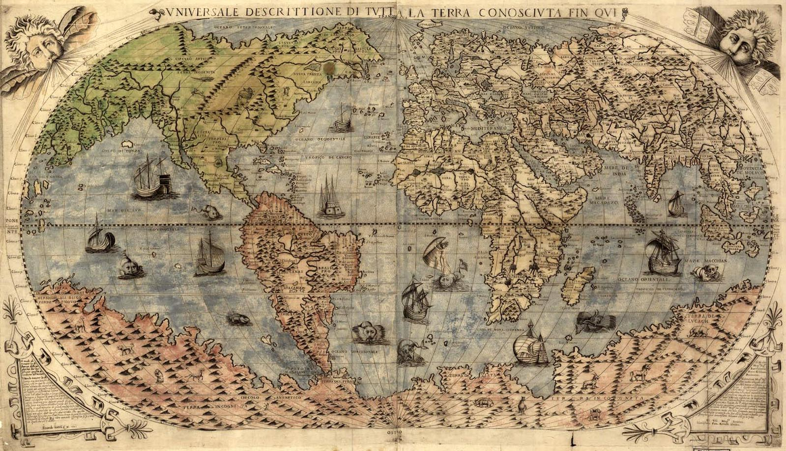

# Improving Your Code With Union Types

^ Welcome everyone. Today we're talking about improving code with union types

^ Don't know what that is, that's OK

^ Before we explain, address the elephant in the room

---

## What is "good code"?

^ Discussions on "good" code are controversial

---


---

## Commonly accepted attributes

* Expressive
* Easier to change
* Easier to read
* More modular
* More correct

^ Expressive easy to translate real world ideas into code

^ Others...

^ These all sound great. How can Union Types help us?

---

## Terminology


^ First we need to define some terminology

---

## Sum types (AKA Enums)

```elm
type Suit
  = Hearts
  | Spades
  | Diamonds
  | Clubs
```

^ Sum types are a list of alternative values

^ Many languages call these Enums

^ Convenient because it allows us to specify what all the possible values are

^ Quick trick for remembering the name "Sum type"

^ How many suit types are there?

---

## 4 different suits

^ The number of possible values in a "sum type" is the sum of the definitions

---

## Product types (AKA Tagged values)

```elm
type Card = Card Value Suit
```

---

## 13 values x 4 Suits = 52

---


---

## Combining them together

```elm
type Coloring = Colored | Grayscale

type Card
  = Card Value Suit
  | Joker Coloring
```

---

## (13 x 4) + 2 = 54

---

## Type variables

```elm
type Maybe a
  = Nothing
  | Just a
```

---

## What are they good for?

---

## Let's talk about Booleans


---

## Three-State Boolean problem

```elm
type alias Order =
  { id : Int
  , delivery : Maybe Bool
  }
```

---

## Three states

1. `Just True`
2. `Just False`
3. `Nothing`

---

## Sum type

```elm
type Delivery = Delivery | Pickup | NoneSelected

type alias Order =
  { id : Int
  , delivery : Delivery
  }
```

---

## Improvements

* :white_check_mark: Easier to change
* :white_check_mark: Easier to read
* :x: More modular
* :x: More correct

---


---

## Double Dependant Boolean

```elm
type alias Order =
  { id : Int
  , delivery : Bool
  , thirdParty : Bool
  }
```

---

## Four states

* True True
* True False
* False True
* False False

---

## What does this even mean

```elm
{ id = 1
, delivery = False
, thirdParty = True
}
```

---

## Sum type

```elm
type Delivery
  = Delivery
  | Pickup
  | ThirdPartyDelivery
  | NotSelected

type alias Order =
  { id : Int
  , delivery : Delivery
  }
```

---

## Improvements

* :white_check_mark: Easier to change
* :white_check_mark: Easier to read
* :x: More modular
* :x: More correct

---

## Boolean Flags


---

## Less readable

```elm
npc : Character
npc =
  Character True True False
```

---

## More readable

```elm
npc : Character
npc =
  Character Immortal Female Stationary
```

---

## Looks like

```elm
type Mortality = Mortal | Immortal
type Gender = Male | Female
type Mobility = Stationary | Mobile

type alias Character =
  { mortality : Mortality
  , gender : Gender
  , mobility : Mobility
  }
```

---

## More extensible

```elm
type Gender = Female | Male | NonBinary
```

---

## Improvements

* :white_check_mark: Easier to change
* :white_check_mark: Easier to read
* :x: More modular
* :x: More correct

---

## Why not Strings?


---

## How Many Mobilities?

```elm
type Mobility = Mobile | Stationary
```

---

## How Many Mobilities?

```elm
type alias Mobility = String
```

---

## Case statements

```elm
move : Int -> Character -> Character
move distance character =
  case character.mobility of
    "Mobile" ->
      { character | position = character.position + distance }

    "Stationary" ->
      character
    _ ->
      character
```

---

## Sum type gives error

```
-- MISSING PATTERNS ------------------------------------------------------------

This `case` does not have branches for all possibilities.

11|>    case character.mobility of                                                         
12|>      Mobile ->                                                                      
13|>        { character | position = character.position + distance }                       
14|>                                                                                       
15|>      Stationary ->                                                                  
16|>        character

You need to account for the following values:

    Flying
```

---

## Typos

```elm
npc : Character
npc =
  Character "Mobil" 55
```

---

## Sum type gives error

```
-- NAMING ERROR ----------------------------------------------------------------

Cannot find variable `Mobil`

20|   Character Mobil 55
                ^^^^^
Maybe you want one of the following?

    Mobile
```

---

## Improvements

* :white_check_mark: Easier to change
* :white_check_mark: Easier to read
* :x: More modular
* :white_check_mark: More correct

---


---

## Dangerous primitives

```elm
type alias User =
  { name : String
  , age : Int
  , bankBalance : Int
  , salary : Int
  }
```

---

## Working with Cash

```elm
addBalance : User -> Int -> User
addBalance user amount =
  { user | bankBalance = bankBalance + amount }
```

---

## Invalid operation

```elm
payday : User -> User
payday user =
  addBalance user user.age
```

---

## Custom type

```elm
type Dollar = Dollar Int

type alias User =
  { name : String
  , age : Int
  , bankBalance : Dollar
  , salary : Dollar
  }
```

---

## Using Dollar

```elm
addBalance : User -> Dollar -> User
addBalance user dollarAmount =
  let
      (Dollar balance) = user.bankBalance
      (Dollar amount) = dollarAmount
  in
      { user | bankBalance = Dollar (balance + amount) }
```

---

## Invalid operation

```elm
payday : User -> User
payday user =
  addBalance user user.age
```
---

## Compiler error

```
-- TYPE MISMATCH ---------------------------------------------------------------

The 2nd argument to function `addBalance` is causing a mismatch.

21|     addBalance user user.age
                        ^^^^^^^^
Function `addBalance` is expecting the 2nd argument to be:

    Dollar

But it is:

    Int
```

---


---

## Pain points

1. Unwrap value
2. Add the integers
3. Re-wrap value

---

## Sound familiar?

---

## Mapping



1. Unwrap value
2. Apply function
3. Re-wrap value

---

## Mapping Maybe

```elm
doubleMaybe : Maybe Int -> Maybe Int
doubleMaybe maybe =
  Maybe.map (\n -> n * 2 ) maybe

```

---

## Summing two Maybes

```elm
sumMaybe : Maybe Int -> Maybe Int -> Maybe Int
sumMaybe m1 m2 =
  Maybe.map2 (+) m1 m2
```

---

## We need that

If only there was a `Dollar.map2`

---

## Mapping to the rescue

```elm
module Dollar exposing (Dollar, map2)

map2 : (Int -> Int) -> Dollar -> Dollar -> Dollar
map2 function (Dollar d1) (Dollar d2) =
  Dollar (function d1 d2)
```

---

## Using Dollar

```elm
addBalance : User -> Dollar -> Dollar
addBalance user amount =
  { user | bankBalance = Dollar.map2 (+) user.bankBalance amount }
```

---

## Getting clever


```elm
module Dollar exposing (Dollar, map2)

sum : Dollar -> Dollar -> Dollar
sum =
  map2 (+)
```

---

## General utility

* `map`
* `map2`
* `sum`
* `subtract`
* `multiply`
* `divide`

---

## Improvements

* :white_check_mark: Easier to change
* :white_check_mark: Easier to read
* :x: More modular
* :white_check_mark: More correct

---

## Opaque types

---

## Start with this

```elm
module Point exposing (Point)

type alias Point = { x : Int, y : Int }
```

---

## Use in in Code

```elm
path : List Point
path =
  [ Point 1 1,
  , Point 100 100
  ]
```

---

## Now you want to add 3D

```elm
module Point exposing (Point)

type alias Point = { x : Int, y : Int, z : Int}
```

---

## Broken code

---

## Wrapping in a type

```elm
module Point exposing (Point, fromXY)

type Point = Point { x : Int, y : Int }

fromXY : (Int, Int) -> Point
fromXY (x, y) =
  Point { x = x, y = y }
```

---

## Adding 3D

```elm
module Point exposing (Point, fromXY)

type Point = Point { x : Int, y : Int, z : Int }

fromXY : (Int, Int) -> Point
fromXY (x, y) =
  Point { x = x, y = y, z = 0 }
```

---

## Improvements

* :white_check_mark: Easier to change
* :white_check_mark: Easier to read
* :white_check_mark: More modular
* :x: More correct

---

## The shape of data


---

## Primitives

```elm
type alias Card =
  { suit : String
  , value : Int
  }
```

---

## Looks like

```elm
Card "Hearts" 2
```

---

## How Many of this type of card?

---

## This is valid

```elm
Card "Starfish" 1999
```

---

## How do you represent the Joker?


---

## You have to force it

```elm
Card "Joker" 0
```

or

```elm
Card "Joker" Nothing
```

---

## Union types allow multiple shapes

```elm
type Card
  = Card Value Suit
  | Joker Coloring
```

---

## Improvements

* :white_check_mark: Easier to change
* :white_check_mark: Easier to read
* :x: More modular
* :white_check_mark: More correct
* :white_check_mark: More _expressive_

---

## Improve your code with Union Types

---

## Questions?

---

## Slides are on GitHub

https://github.com/JoelQ/adts-elm-meetup

---

## About Me


* Developer at thoughtbot
* @joelquen on Twitter
* @JoelQ on GitHub
